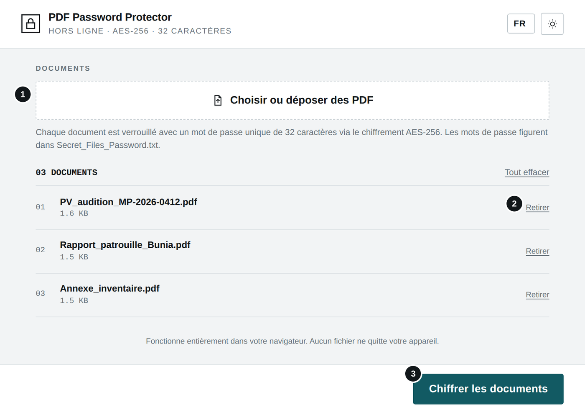
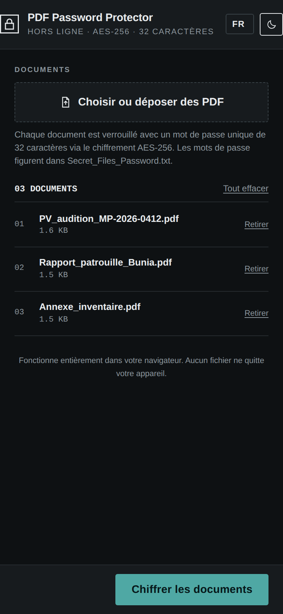
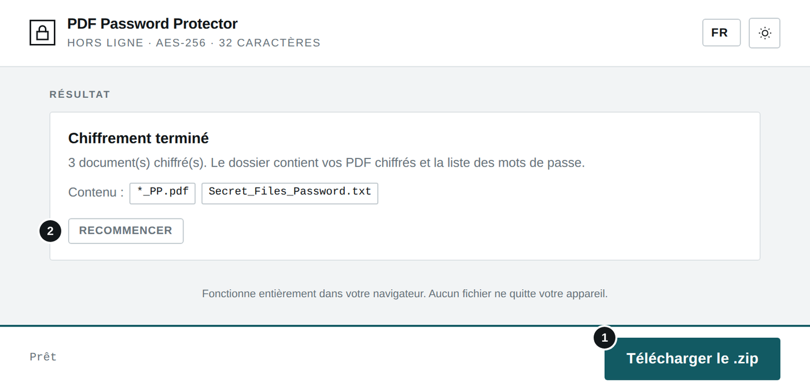
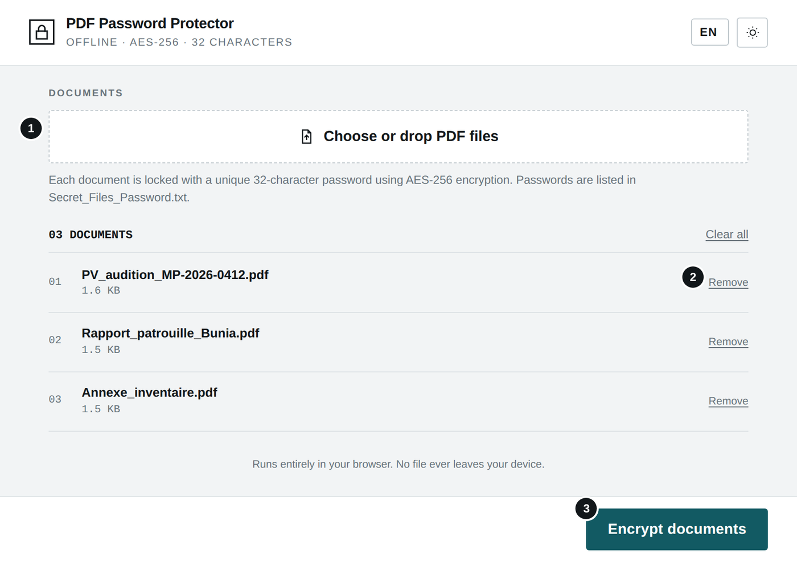
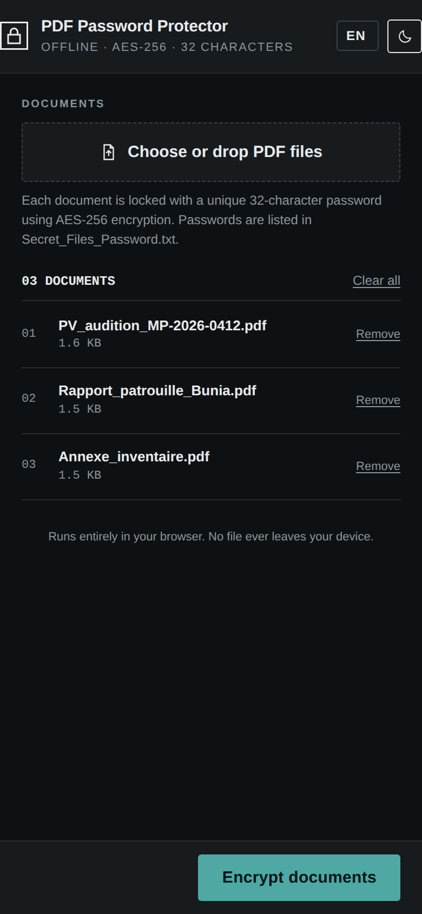
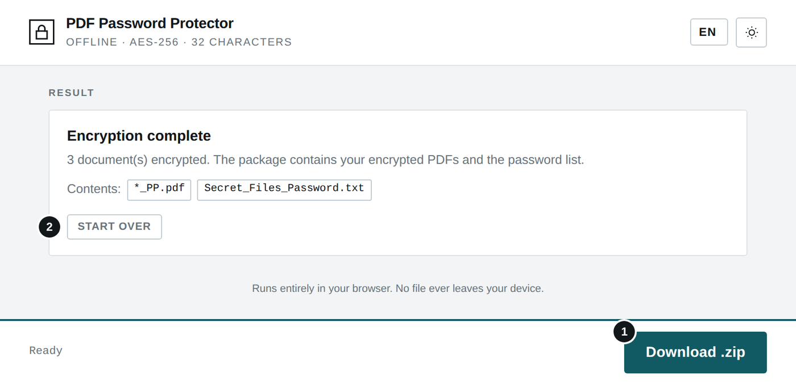

# PDF Password Protector

**`PDF_PASSWORD_PROTECTOR.html`** · Hors ligne · Aucune installation · Aucun envoi — *Offline · No install · No upload*

**[Français](#français) · [English](#english)**

---

## Français

### À quoi sert cet outil

Cet outil chiffre un ou plusieurs documents PDF avec l'algorithme AES-256. Chaque document reçoit un mot de passe unique et aléatoire de 32 caractères. Le résultat est un dossier compressé (.zip) contenant les PDF protégés et la liste des mots de passe.

### Avant de commencer

- Ouvrez le fichier PDF_PASSWORD_PROTECTOR.html par double-clic : il s'affiche dans votre navigateur (Chrome, Edge, Firefox ou Safari récents). Aucune installation n'est nécessaire.
- L'outil fonctionne sans connexion Internet. Aucun fichier n'est envoyé : tout le traitement se fait sur votre appareil.
- La langue (FR, EN, SW, LN) se choisit en haut à droite ; le bouton voisin bascule entre thème clair et sombre. Ces choix sont mémorisés.

### L'écran en un coup d'œil

1. Choisir ou déposer des PDF (glisser-déposer possible)
2. Retirer un document de la liste
3. Chiffrer les documents

#### Sur téléphone (thème sombre)

### Utilisation pas à pas

1. Cliquez sur « Choisir ou déposer des PDF » ou faites glisser les fichiers sur la zone. Seuls les PDF sont acceptés.
2. Vérifiez la liste. « Retirer » enlève un document, « Tout effacer » vide la liste.
3. Cliquez sur « Chiffrer les documents ». La barre du bas indique le document en cours de traitement.
4. Une fois le chiffrement terminé, cliquez sur « Télécharger le .zip » (fichier Protected_PDFs.zip).
5. « Recommencer » permet de traiter un nouveau lot.

#### Contenu du fichier .zip

| Fichier | Description |
|---|---|
| **NomDuDocument_PP.pdf** | Document chiffré. Le suffixe _PP est ajouté au nom d'origine. |
| **Secret_Files_Password.txt** | Liste « fichier → mot de passe », une ligne par document. Exemple : PV_audition_MP-2026-0412_PP.pdf   7j+4WMu=!orCtY@R4)(MzHADz(oyqfU+ |

### Résultat

1. Télécharger le .zip
2. Recommencer

*Écran de fin : nombre de documents chiffrés et contenu du dossier.*

### Bonnes pratiques

- Ne transmettez jamais le fichier des mots de passe par le même canal que les PDF : par exemple, les PDF par e-mail et les mots de passe par téléphone ou en main propre.
- Conservez Secret_Files_Password.txt en lieu sûr. Sans lui, les documents ne peuvent plus être ouverts : il n'existe aucune récupération possible.
- Pour déverrouiller un document, utilisez l'outil PDF Password Remover.
- Après l'envoi, supprimez le .zip de votre dossier Téléchargements.

### En cas de problème

| Problème | Solution |
|---|---|
| **Un document manque dans le .zip** | Il n'a pas pu être chiffré (fichier endommagé ou déjà protégé). Le message de fin le signale et la ligne correspondante indique [ERROR] dans le fichier des mots de passe. |
| **Le PDF est déjà protégé** | Retirez d'abord sa protection avec PDF Password Remover, puis chiffrez-le à nouveau. |
| **Le traitement est lent** | Les PDF volumineux (plusieurs dizaines de Mo) demandent plus de temps. Laissez l'onglet ouvert jusqu'à la fin. |

### Confidentialité

L'outil fonctionne entièrement sur votre appareil, sans connexion Internet. Aucune donnée n'est transmise ni conservée en dehors des fichiers que vous téléchargez vous-même.

---

## English

### What this tool is for

This tool encrypts one or more PDF documents with AES-256. Each document gets its own random 32-character password. The result is a compressed folder (.zip) holding the protected PDFs and the list of passwords.

### Before you start

- Double-click PDF_PASSWORD_PROTECTOR.html: it opens in your browser (recent Chrome, Edge, Firefox or Safari). Nothing to install.
- The tool works without an Internet connection. No file is uploaded: everything is processed on your device.
- Choose the language (FR, EN, SW, LN) at the top right; the button next to it switches between light and dark theme. Both choices are remembered.

### The screen at a glance

1. Choose or drop PDF files (drag and drop works)
2. Remove a document from the list
3. Encrypt documents

#### On a phone (dark theme)

### Step by step

1. Click “Choose or drop PDF files” or drag the files onto the area. Only PDFs are accepted.
2. Check the list. “Remove” takes a document out, “Clear all” empties the list.
3. Click “Encrypt documents”. The bottom bar shows the document being processed.
4. When encryption is complete, click “Download .zip” (file Protected_PDFs.zip).
5. “Start over” lets you process a new batch.

#### Contents of the .zip

| File | Description |
|---|---|
| **DocumentName_PP.pdf** | Encrypted document. The _PP suffix is added to the original name. |
| **Secret_Files_Password.txt** | “file → password” list, one line per document. |

### Result

1. Download .zip
2. Start over

*End screen: number of documents encrypted and package contents.*

### Good practice

- Never send the password file through the same channel as the PDFs: for example, PDFs by e-mail and passwords by phone or in person.
- Keep Secret_Files_Password.txt somewhere safe. Without it the documents can no longer be opened: there is no recovery.
- To unlock a document, use PDF Password Remover.
- Once sent, delete the .zip from your Downloads folder.

### Troubleshooting

| Problem | Solution |
|---|---|
| **A document is missing from the .zip** | It could not be encrypted (damaged or already protected). The end message reports it and its line shows [ERROR] in the password file. |
| **The PDF is already protected** | Remove its protection first with PDF Password Remover, then encrypt it again. |
| **Processing is slow** | Large PDFs (tens of MB) take longer. Keep the tab open until it finishes. |

### Privacy

The tool runs entirely on your device, without an Internet connection. No data is sent or kept anywhere other than the files you download yourself.
